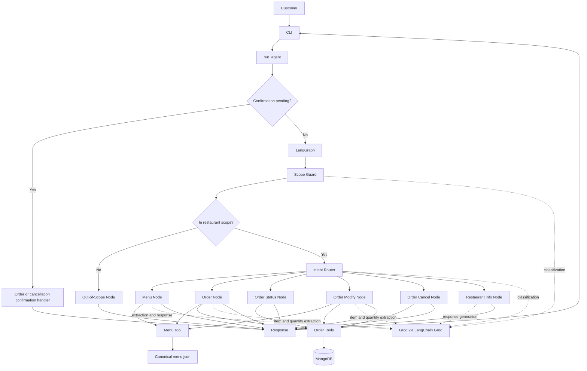

# Restaurant AI Agent

A command-line conversational restaurant agent built with LangGraph, Groq through LangChain Groq, and MongoDB. It routes restaurant requests to focused nodes, uses canonical menu data for validation and pricing, and persists an order only after the customer confirms it.

## Key Features

- Restaurant scope guard and intent classification
- Menu search over canonical JSON menu data
- Single-item and multi-item order creation
- Order summary and confirmation before persistence
- Order status lookup using the current conversation's order ID
- Single-item order modification
- Order cancellation with explicit confirmation
- Restaurant information queries
- Out-of-scope request handling
- Typed, state-driven conversation flow
- Menu, quantity, availability, and price validation
- Safe error responses for LLM, menu, and order-store failures
- MongoDB persistence through PyMongo
- Groq LLM integration through LangChain Groq
- 46 deterministic `unittest` regression tests
- GitHub Actions CI on pushes and pull requests

## Architecture



### Major Layers

- **CLI and `run_agent()`:** accepts customer messages, carries `RestaurantState` between turns, dispatches pending yes/no confirmations, and converts service failures into safe responses.
- **LangGraph:** runs the scope guard and intent router, then routes each new request to its relevant node.
- **Graph nodes:** use the LLM for language understanding and response generation, while keeping validation, totals, and order-ID resolution in Python.
- **Tools and data:** `menu.py` reads and validates `menu.json`; `orders.py` owns MongoDB order operations. Restaurant facts come from `restaurant_info.py`.
- **State:** retains the current message, scope, intent, staged order, most recent order ID, confirmation flags, and response.

Pending order and cancellation confirmations are handled by `run_agent()` on the following turn. Order creation is not sent to MongoDB while it is only staged.

## Order Lifecycle

1. The order node asks the LLM to extract requested item names and quantities.
2. Python matches every item to the canonical menu and checks availability and positive quantity.
3. Python takes IDs and prices from menu data and calculates each line amount and the total.
4. The agent presents a complete summary and waits for confirmation.
5. Only a `yes` response calls the MongoDB create operation. A `no` discards the staged order.

If extraction or validation fails for any item, the entire order is rejected; no partial order is staged or persisted.

### Multi-Item Example

Customer:

> I want 2 Cheese Veg Burgers and 1 Classic French Fries

The agent resolves the names, item IDs, availability, and prices from `menu.json`. With the current menu, the Python-calculated total is `2 × ₹179 + 1 × ₹99 = ₹457`. The complete summary is shown before any database write.

## Modification and Cancellation

- **Modification:** the current flow extracts one replacement item and quantity, validates it against the canonical menu, recalculates the total in Python, and updates a pending order. This operation is immediate; multi-item modification is not implemented.
- **Cancellation:** the agent first asks for confirmation. `no` leaves the order unchanged; `yes` changes the pending order's status to `cancelled`.
- **Status:** the agent resolves an explicit MongoDB ObjectId from the message or falls back to the latest order ID in conversation state. Stored order items and total are displayed.

## Error Handling

- LLM invocation failures or missing response text produce a retry message; diagnostic logs include only the operation and exception type.
- Invalid JSON or incomplete order extraction fails closed without staging or persisting an order.
- Unknown items, unavailable items, and non-positive quantities are rejected before persistence.
- Menu loading validates file access, JSON structure, required item fields, price/availability types, and unique IDs.
- Invalid ObjectIds are rejected without querying or mutating an order. Missing orders are reported as not found; MongoDB failures return an order-system retry response.
- Blank CLI input asks the user to enter a message. `exit`, `quit`, EOF, and `KeyboardInterrupt` retain normal exit behavior.

## Tech Stack

| Technology | Use |
| --- | --- |
| Python 3.14 | Application and regression tests |
| LangGraph | Request routing and graph execution |
| Groq / LangChain Groq | LLM access for classification, extraction, and responses |
| MongoDB | Order persistence |
| PyMongo | MongoDB client and BSON/ObjectId support |
| python-dotenv | Local environment configuration |
| `unittest` | Deterministic regression suite |
| GitHub Actions | Push and pull-request CI |

## Environment Variables

Set these variable names in a local `.env` file:

```text
GROQ_API_KEY
MONGODB_URI
MONGODB_DATABASE
```

Do not commit `.env`. It is ignored by Git. The application loads these values locally through `python-dotenv`.

## Installation

```powershell
git clone <REPOSITORY_URL>
cd restaurant-ai-agent
python -m venv venv
.\venv\Scripts\Activate.ps1
python -m pip install --upgrade pip
pip install -r requirements.txt
notepad .env
```

Add the required variable names and your local values to `.env`, then save and close the editor. Keep the file local.

## Run

```powershell
python -m app.main
```

Enter a restaurant request at the `Customer:` prompt. Enter `exit` or `quit` to leave.

## Example Conversation

```text
Customer: I want 2 Cheese Veg Burgers and 1 Classic French Fries
Agent: Here's your order summary ... Total: ₹457. Would you like me to place this order?

Customer: yes
Agent: Your order has been placed successfully! ...

Customer: what is the status of my order
Agent: Status: pending ...

Customer: modify my order to 2 Paneer Burgers
Agent: Your order has been modified successfully! ...

Customer: cancel my order
Agent: Are you sure you want to cancel order <order_id>? Reply 'yes' ...

Customer: yes
Agent: Your order has been cancelled successfully!

Customer: what are your timings?
Agent: [Restaurant hours from configured restaurant information]

Customer: explain binary search in Java
Agent: Sorry, I can only help with restaurant-related queries and orders.
```

The modification example replaces the pending order contents with one item; it does not demonstrate multi-item modification.

## Testing

Run the deterministic regression suite and syntax compilation:

```powershell
python -m unittest discover -s tests -v
python -m compileall app tests
```

The suite contains 46 tests. It exercises the real graph and application logic while stubbing Groq and MongoDB operations; it does not require service credentials or network access.

Real Groq and MongoDB connectivity and a controlled end-to-end order lifecycle have also been manually verified separately. Those checks are not part of the automated suite and require valid local environment variables. The test order was cancelled after verification; the application has no delete helper.

## CI

`.github/workflows/ci.yml` runs on `push` and `pull_request` using Ubuntu and Python 3.14. It upgrades pip, installs `requirements.txt`, runs `pip check`, compiles `app` and `tests`, and runs the complete unittest suite. The automated workflow does not need a real `.env`, Groq API key, or MongoDB server.

## Project Structure

```text
restaurant-ai-agent/
├── .github/
│   └── workflows/
│       └── ci.yml
├── app/
│   ├── agents/
│   │   └── restaurant_agent.py
│   ├── data/
│   │   ├── menu.json
│   │   └── restaurant_info.py
│   ├── graph/
│   │   ├── graph.py
│   │   ├── nodes.py
│   │   └── state.py
│   ├── services/
│   │   └── validation.py
│   ├── tools/
│   │   ├── billing.py
│   │   ├── inventory.py
│   │   ├── menu.py
│   │   └── orders.py
│   └── main.py
├── tests/
│   └── test_regression.py
├── .gitignore
├── README.md
└── requirements.txt
```

## Design Decisions

- The LLM interprets natural language; Python owns canonical matching, validation, ObjectId handling, and price arithmetic.
- `menu.json` is the source of truth for item IDs, names, prices, and availability.
- An order is staged in conversation state and persisted only after explicit confirmation.
- LangGraph routes new messages; `run_agent()` handles pending confirmation replies using state.
- Invalid extraction and invalid menu data fail closed instead of creating incomplete or guessed orders.
- MongoDB stores orders; restaurant information remains local configuration data.

## Future Improvements

- Multi-item order modification
- REST API and web interface
- Authentication and authorization
- Payment integration and delivery tracking
- Structured observability and retry/backoff policies
- Richer conversational memory across sessions
